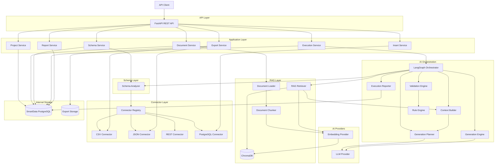
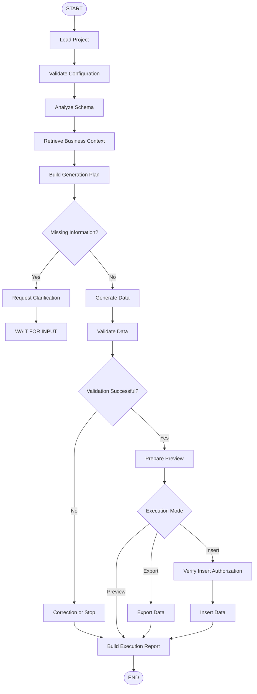

# SmartData Generator

## Architecture technique globale

**Version :** 1.0
**Statut :** Draft
**Projet :** SmartData Generator
**Type de projet :** Proof of Concept industrialisable
**Contexte :** Certification RNCP Développeur en Intelligence Artificielle

---

# 1. Introduction

Ce document décrit l’architecture technique globale de SmartData Generator.

SmartData Generator est un service d’intelligence artificielle indépendant conçu pour générer des données métier synthétiques, cohérentes et validées à partir :

* d’un schéma cible ;
* de règles métier ;
* d’une documentation métier ;
* de paramètres de génération ;
* de données existantes lorsque leur lecture est autorisée.

L’architecture doit permettre de réutiliser le service dans différents domaines fonctionnels sans modifier son cœur.

Aucune logique métier spécifique à Pricing Control Tower ne doit être intégrée dans SmartData Generator.

Pricing Control Tower constitue uniquement un démonstrateur du service.

---

# 2. Objectifs de l’architecture

L’architecture doit permettre de :

* séparer clairement les responsabilités ;
* rendre les composants indépendants ;
* remplacer facilement un fournisseur LLM ;
* remplacer facilement un fournisseur d’embeddings ;
* ajouter de nouveaux connecteurs ;
* isoler le moteur IA des systèmes externes ;
* analyser les schémas de manière déterministe ;
* exploiter la documentation métier grâce à un RAG ;
* produire des sorties structurées ;
* valider les données avant toute écriture ;
* garantir une confirmation explicite avant insertion ;
* tracer chaque exécution ;
* faciliter les tests ;
* permettre une industrialisation progressive.

---

# 3. Principes d’architecture

## 3.1 Architecture modulaire

L’application est découpée en modules spécialisés.

Chaque module possède une responsabilité clairement définie.

Les principaux modules sont :

* API ;
* services applicatifs ;
* orchestration LangGraph ;
* analyse du schéma ;
* RAG ;
* intégration LLM ;
* génération ;
* validation ;
* connecteurs ;
* export ;
* insertion ;
* reporting ;
* stockage interne.

---

## 3.2 Séparation des responsabilités

Les responsabilités doivent rester séparées.

L’API reçoit les requêtes mais ne génère pas les données.

L’agent orchestre les étapes mais n’écrit pas directement dans une destination.

Le RAG fournit les règles métier mais ne détermine pas le schéma technique.

Le Schema Analyzer décrit le schéma mais n’interprète pas les règles métier.

Les connecteurs lisent ou écrivent les données mais ne contiennent aucune logique IA.

Le Validation Engine contrôle les données mais ne décide pas de leur insertion.

L’Insert Service exécute l’écriture uniquement après autorisation explicite.

---

## 3.3 Dépendance vers des interfaces abstraites

Les services principaux doivent dépendre d’interfaces et non d’implémentations concrètes.

Le moteur de génération ne doit pas dépendre directement de PostgreSQL, CSV, JSON ou d’une API REST spécifique.

Le moteur doit interagir avec des contrats génériques.

Cette approche permet d’ajouter un nouveau connecteur sans modifier le cœur de l’application.

---

## 3.4 Configuration plutôt que code spécifique

Les particularités métier doivent être fournies par :

* le schéma ;
* la documentation ;
* les règles métier ;
* les paramètres de génération ;
* la configuration du projet.

Aucune règle métier propre à un domaine ne doit être codée directement dans le moteur.

---

## 3.5 Preview par défaut

Le mode Preview constitue le comportement par défaut.

Toute génération doit pouvoir être analysée et validée avant une opération d’écriture.

Le mode Export ou Insert ne doit être déclenché qu’après validation.

---

## 3.6 Validation humaine avant écriture

Une donnée techniquement valide ne doit pas être insérée automatiquement.

Le système distingue :

* la validation technique ;
* la validation métier ;
* l’autorisation d’insertion.

L’utilisateur doit demander explicitement l’insertion.

---

## 3.7 Sorties IA structurées

Les réponses critiques du LLM doivent respecter des modèles structurés.

Cela concerne notamment :

* le plan de génération ;
* les demandes de clarification ;
* les stratégies de génération ;
* les données générées par le LLM ;
* les explications de validation ;
* les résultats d’exécution.

Les structures doivent être validées avec Pydantic.

---

## 3.8 Validation déterministe

Le LLM peut aider à comprendre ou à proposer.

La validation finale doit être réalisée autant que possible avec des mécanismes déterministes.

Le LLM ne doit pas être l’unique source de validation.

---

## 3.9 Traçabilité

Chaque exécution doit posséder un identifiant unique.

Les principales étapes doivent être enregistrées :

* création de l’exécution ;
* analyse du schéma ;
* recherche documentaire ;
* création du plan ;
* génération ;
* validation ;
* export ;
* insertion ;
* erreur ;
* fin de l’exécution.

---

# 4. Vue globale de l’architecture

L’architecture est organisée en plusieurs couches.

```text
API Layer
    |
    v
Application Services
    |
    v
LangGraph Orchestrator
    |
    +-- Schema Analyzer
    |
    +-- RAG Retriever
    |
    +-- Generation Planner
    |
    +-- Generation Engine
    |
    +-- Validation Engine
    |
    +-- Execution Reporter
    |
    v
Connector Interfaces
    |
    +-- CSV Connector
    |
    +-- JSON Connector
    |
    +-- REST Connector
    |
    +-- PostgreSQL Connector
```

---

# 5. Architecture par plans fonctionnels

## 5.1 Control Plane

Le Control Plane gère les éléments de pilotage du service.

Il contient notamment :

* les projets ;
* les configurations ;
* les connexions ;
* les documents ;
* les demandes de génération ;
* les statuts ;
* les rapports ;
* les métadonnées d’exécution.

Il ne réalise pas directement la génération.

---

## 5.2 Generation Plane

Le Generation Plane gère le workflow de génération.

Il contient :

* l’analyse du contexte ;
* l’analyse du schéma ;
* la recherche RAG ;
* la planification ;
* la génération ;
* la validation ;
* les clarifications ;
* la création du Preview.

---

## 5.3 Integration Plane

L’Integration Plane gère les échanges avec les systèmes externes.

Il contient :

* les connecteurs ;
* la lecture des fichiers ;
* les appels REST ;
* l’inspection PostgreSQL ;
* l’export ;
* l’insertion ;
* les transactions.

---

# 6. Composants principaux

# 6.1 API Layer

L’API Layer expose SmartData Generator aux applications clientes.

La technologie retenue est FastAPI.

## Responsabilités

L’API doit permettre de :

* créer un projet ;
* consulter un projet ;
* enregistrer une configuration ;
* associer des documents ;
* lancer une indexation ;
* lancer une analyse du schéma ;
* lancer une génération ;
* demander un Preview ;
* demander un Export ;
* demander un Insert ;
* consulter une exécution ;
* récupérer un rapport ;
* consulter le statut du service.

L’API est également responsable de :

* la validation des requêtes ;
* la sérialisation des réponses ;
* la gestion des erreurs HTTP ;
* la documentation OpenAPI ;
* l’attribution d’un identifiant de corrélation.

## Limites

L’API ne doit pas :

* contenir directement la logique IA ;
* analyser elle-même les schémas ;
* accéder directement à ChromaDB ;
* écrire directement dans une base cible ;
* construire les prompts ;
* exécuter les règles métier.

---

# 6.2 Application Services

Les Application Services implémentent les cas d’usage du service.

Ils représentent la couche intermédiaire entre l’API et les composants techniques.

## Responsabilités

Ils doivent :

* charger un projet ;
* vérifier la configuration ;
* lancer les opérations ;
* coordonner les composants ;
* appliquer les règles applicatives ;
* gérer les statuts ;
* préparer les réponses ;
* gérer les transactions applicatives.

Les principaux services sont :

* Project Service ;
* Document Service ;
* Schema Service ;
* Execution Service ;
* Export Service ;
* Insert Service ;
* Report Service.

---

# 6.3 Project Service

Le Project Service gère le cycle de vie d’un projet.

## Responsabilités

Il doit permettre de :

* créer un projet ;
* modifier sa configuration ;
* associer une source ;
* associer une destination ;
* associer des documents ;
* enregistrer les paramètres de génération ;
* récupérer l’historique ;
* activer ou désactiver un projet.

Un projet représente un contexte de génération indépendant.

Il ne contient aucune logique métier codée.

---

# 6.4 Document Service

Le Document Service gère les documents fournis au RAG.

## Responsabilités

Il doit :

* enregistrer un document ;
* valider son format ;
* stocker ses métadonnées ;
* déclencher son indexation ;
* consulter son statut ;
* supprimer son index ;
* réindexer une nouvelle version.

---

# 6.5 Schema Service

Le Schema Service gère l’analyse et la conservation du schéma normalisé.

## Responsabilités

Il doit :

* sélectionner le connecteur adapté ;
* demander l’inspection du schéma ;
* appeler le Schema Analyzer ;
* enregistrer le schéma normalisé ;
* comparer une nouvelle version du schéma ;
* détecter les changements ;
* mettre le schéma à disposition du workflow.

---

# 6.6 Execution Service

L’Execution Service gère le cycle de vie d’une génération.

## Responsabilités

Il doit :

* créer une exécution ;
* attribuer un identifiant unique ;
* enregistrer le mode demandé ;
* lancer le workflow ;
* suivre le statut ;
* enregistrer les étapes ;
* stocker les erreurs ;
* stocker les avertissements ;
* conserver les résultats ;
* clôturer l’exécution.

## Statuts conceptuels

Les statuts suivants sont envisagés :

```text
PENDING
RUNNING
WAITING_FOR_INPUT
VALIDATION_FAILED
READY
EXPORTED
INSERTED
FAILED
```

Les valeurs définitives seront validées lors de la conception des modèles.

---

# 6.7 LangGraph Orchestrator

LangGraph est utilisé pour orchestrer le workflow agentique.

Il représente les différentes étapes sous forme de graphe contrôlé.

## Responsabilités

LangGraph doit :

* maintenir l’état du workflow ;
* exécuter les étapes dans le bon ordre ;
* gérer les transitions ;
* gérer les branches conditionnelles ;
* appeler uniquement les outils autorisés ;
* interrompre le workflow ;
* attendre une clarification ;
* reprendre une exécution ;
* arrêter le workflow en cas d’erreur bloquante ;
* transmettre les résultats entre les nœuds.

## Limites

LangGraph ne réalise pas directement :

* l’analyse technique du schéma ;
* la recherche vectorielle ;
* la génération déterministe ;
* l’écriture dans PostgreSQL ;
* l’export CSV ou JSON.

LangGraph orchestre les composants responsables de ces actions.

---

# 6.8 Schema Analyzer

Le Schema Analyzer transforme les métadonnées brutes fournies par un connecteur en une représentation normalisée.

## Responsabilités

Il doit identifier :

* les entités ;
* les tables ;
* les colonnes ;
* les propriétés ;
* les types ;
* les champs obligatoires ;
* les valeurs par défaut ;
* les clés primaires ;
* les clés étrangères ;
* les relations ;
* les contraintes ;
* les dépendances ;
* les contraintes d’unicité ;
* l’ordre logique de génération.

## Règle fondamentale

Le Schema Analyzer constitue la source de vérité technique concernant le schéma.

Le LLM et le RAG ne doivent jamais inventer ou remplacer le schéma cible.

---

# 6.9 RAG Ingestion Pipeline

Le RAG Ingestion Pipeline prépare les documents métier pour la recherche vectorielle.

## Responsabilités

Il doit :

* charger les documents ;
* extraire leur contenu ;
* nettoyer le texte ;
* découper le contenu ;
* enrichir les chunks ;
* générer les embeddings ;
* indexer les chunks ;
* stocker les références aux sources ;
* gérer la version des documents.

## Étapes

```text
Document
    |
    v
Document Loader
    |
    v
Parser
    |
    v
Chunker
    |
    v
Metadata Enrichment
    |
    v
Embedding Provider
    |
    v
ChromaDB
```

---

# 6.10 Document Loader

Le Document Loader charge le contenu des documents supportés.

## Responsabilités

Il doit :

* vérifier le format ;
* lire le contenu ;
* extraire le texte ;
* détecter les erreurs ;
* préserver les informations de source ;
* produire une représentation homogène.

Les formats exacts seront définis au moment de l’implémentation du RAG.

---

# 6.11 Document Chunker

Le Document Chunker découpe les documents en unités adaptées à la recherche vectorielle.

## Responsabilités

Il doit :

* respecter les sections ;
* limiter la taille des chunks ;
* conserver le contexte ;
* éviter les découpages incohérents ;
* ajouter les métadonnées ;
* conserver la référence du document.

Le découpage doit privilégier la structure du document plutôt qu’un découpage arbitraire.

---

# 6.12 Embedding Provider

L’Embedding Provider fournit une interface générique pour la génération des embeddings.

## Responsabilités

Il doit :

* générer les embeddings des documents ;
* générer les embeddings des requêtes ;
* gérer les erreurs ;
* gérer les délais ;
* exposer les informations du modèle ;
* garantir la compatibilité entre indexation et recherche.

Le modèle utilisé pour rechercher dans une collection doit être compatible avec celui utilisé lors de son indexation.

---

# 6.13 ChromaDB

ChromaDB est utilisé comme base vectorielle du POC.

## Responsabilités

ChromaDB doit permettre de :

* stocker les chunks ;
* stocker les embeddings ;
* stocker les métadonnées ;
* isoler les données par projet ;
* rechercher les passages similaires ;
* supprimer une collection ;
* réindexer un corpus.

## Données stockées

ChromaDB contient :

* les textes découpés ;
* les vecteurs ;
* les références documentaires ;
* les métadonnées utiles à la recherche.

## Données non stockées

ChromaDB ne doit pas être utilisé pour stocker :

* les projets ;
* les connexions ;
* les secrets ;
* les datasets générés ;
* les rapports complets ;
* l’état des exécutions ;
* le schéma cible comme source de vérité ;
* les données à insérer.

Ces informations doivent être stockées dans PostgreSQL ou dans le stockage applicatif prévu.

---

# 6.14 RAG Retriever

Le RAG Retriever recherche les passages pertinents dans ChromaDB.

## Responsabilités

Il doit :

* construire la requête de recherche ;
* interroger ChromaDB ;
* filtrer les résultats ;
* limiter le nombre de passages ;
* classer les résultats ;
* éliminer les doublons ;
* retourner les contenus ;
* retourner les métadonnées ;
* retourner les références documentaires.

## Filtres possibles

La recherche pourra être filtrée par :

* projet ;
* document ;
* version ;
* type de contenu ;
* entité ;
* section ;
* domaine ;
* statut du document.

## Règle fondamentale

Le RAG fournit uniquement le contexte métier.

Il ne doit pas remplacer l’analyse du schéma.

Lorsque la documentation contredit le schéma, le conflit doit être signalé.

Il ne doit pas être résolu silencieusement par le LLM.

---

# 6.15 Context Builder

Le Context Builder prépare le contexte transmis au LLM.

## Responsabilités

Il doit combiner :

* la demande utilisateur ;
* le schéma normalisé ;
* les paramètres ;
* les règles récupérées ;
* les passages documentaires ;
* les données existantes autorisées ;
* les contraintes du système.

Il doit également :

* limiter la taille du contexte ;
* supprimer les doublons ;
* préserver les références ;
* séparer les informations techniques des informations métier ;
* éviter l’envoi de données sensibles.

---

# 6.16 LLM Provider

Le LLM Provider encapsule l’accès au modèle de langage.

## Responsabilités

Il doit :

* envoyer les prompts ;
* demander une réponse structurée ;
* valider le format retourné ;
* gérer les erreurs ;
* gérer les délais d’attente ;
* gérer les nouvelles tentatives ;
* collecter les métadonnées ;
* isoler le reste de l’application du fournisseur.

## Interface conceptuelle

```python
class LLMProvider:
    def generate_structured(self, request, output_schema):
        ...
```

Cette interface est conceptuelle.

La signature définitive sera définie lors de l’implémentation.

## Rôle du LLM

Le LLM peut :

* interpréter une demande ;
* identifier des règles pertinentes ;
* construire un plan ;
* détecter des ambiguïtés ;
* proposer une stratégie ;
* produire certains contenus synthétiques ;
* expliquer des erreurs ;
* proposer une correction.

## Limites du LLM

Le LLM ne doit pas :

* inventer le schéma ;
* accéder directement à une base ;
* exécuter du SQL ;
* appeler librement une API distante ;
* écrire dans une destination ;
* contourner une validation ;
* décider seul d’une insertion ;
* modifier les secrets ;
* modifier une configuration technique.

---

# 6.17 Generation Planner

Le Generation Planner construit le plan de génération.

## Entrées

Il reçoit :

* le schéma normalisé ;
* les paramètres utilisateur ;
* les règles métier ;
* le contexte RAG ;
* les données existantes autorisées ;
* le mode d’exécution.

## Responsabilités

Il doit définir :

* les entités concernées ;
* l’ordre de génération ;
* les dépendances ;
* les volumes ;
* les champs à produire ;
* les valeurs de référence ;
* les stratégies de génération ;
* les règles à appliquer ;
* les validations nécessaires ;
* les informations manquantes ;
* les éventuelles demandes de clarification.

## Sortie

Le plan doit être produit sous forme structurée et validé avec Pydantic.

---

# 6.18 Generation Engine

Le Generation Engine exécute le plan.

## Responsabilités

Il doit :

* générer les données entité par entité ;
* respecter l’ordre du plan ;
* maintenir les relations ;
* gérer les identifiants ;
* réutiliser les données existantes autorisées ;
* appliquer les stratégies définies ;
* produire des résultats structurés ;
* conserver la trace de la méthode utilisée ;
* transmettre les données au Validation Engine.

## Stratégies possibles

Le moteur peut combiner :

* génération déterministe ;
* génération aléatoire contrôlée ;
* bibliothèques de données synthétiques ;
* règles configurées ;
* valeurs de référence ;
* génération assistée par LLM.

Le LLM ne doit pas obligatoirement générer chaque valeur.

Pour les gros volumes, les méthodes déterministes doivent être privilégiées.

---

# 6.19 Validation Engine

Le Validation Engine contrôle les données produites.

## Responsabilités

Il doit :

* exécuter les validations ;
* agréger les résultats ;
* distinguer erreurs et avertissements ;
* identifier les lignes concernées ;
* identifier les champs concernés ;
* indiquer la règle violée ;
* déterminer si l’erreur est bloquante ;
* produire un rapport structuré.

## Niveaux de validation

### Validation du contrat

Vérifie :

* la structure ;
* les types ;
* les champs obligatoires ;
* les énumérations.

### Validation du schéma

Vérifie :

* la présence des colonnes ;
* les types compatibles ;
* les valeurs nulles ;
* les contraintes ;
* les longueurs ;
* les formats.

### Validation relationnelle

Vérifie :

* les clés primaires ;
* les clés étrangères ;
* les dépendances ;
* les références ;
* la cohérence entre entités.

### Validation d’unicité

Vérifie :

* les identifiants ;
* les contraintes uniques ;
* les doublons internes ;
* les conflits avec les données existantes.

### Validation métier

Vérifie les règles métier transformées en règles exécutables.

### Validation de destination

Vérifie :

* la compatibilité avec la cible ;
* la disponibilité de la connexion ;
* l’ordre d’insertion ;
* les conflits éventuels.

---

# 6.20 Rule Engine

Le Rule Engine exécute les règles de validation métier pouvant être exprimées sous forme déterministe.

## Responsabilités

Il doit :

* charger les règles structurées ;
* vérifier leur format ;
* les appliquer aux données ;
* produire les violations ;
* indiquer la source documentaire ;
* distinguer les règles bloquantes des avertissements.

Le Rule Engine doit rester indépendant d’un domaine spécifique.

Les règles doivent être configurées et non codées directement dans le cœur.

---

# 6.21 Connector Registry

Le Connector Registry centralise les connecteurs disponibles.

## Responsabilités

Il doit :

* enregistrer les connecteurs ;
* sélectionner le connecteur adapté ;
* vérifier ses capacités ;
* vérifier sa configuration ;
* empêcher l’accès direct à une implémentation non enregistrée ;
* retourner une interface commune.

## Capacités conceptuelles

```text
TEST_CONNECTION
READ_SCHEMA
READ_DATA
WRITE_DATA
EXPORT_DATA
TRANSACTION_SUPPORT
```

Un connecteur n’est pas obligé de supporter toutes les capacités.

---

# 6.22 Interfaces des connecteurs

Les connecteurs doivent implémenter des interfaces communes.

```text
BaseConnector
├── test_connection()
└── get_capabilities()

SchemaReader
└── inspect_schema()

DataReader
└── read_data()

DataWriter
└── write_data()

TransactionalWriter
├── begin()
├── commit()
└── rollback()

Exporter
└── export_data()
```

Ces interfaces sont conceptuelles.

Les signatures définitives seront définies lors de l’implémentation.

---

# 6.23 CSV Connector

Le CSV Connector gère les fichiers CSV.

## Responsabilités

Il doit :

* vérifier l’existence du fichier ;
* vérifier son encodage ;
* détecter le séparateur lorsque cela est possible ;
* lire les colonnes ;
* lire les données ;
* proposer une représentation du schéma ;
* exporter les données en CSV.

## Limites

Le connecteur ne doit pas :

* inventer le sens métier des colonnes ;
* inventer les types lorsqu’ils ne peuvent pas être déterminés ;
* supposer un séparateur sans validation ;
* appliquer des règles métier.

---

# 6.24 JSON Connector

Le JSON Connector gère les fichiers JSON.

## Responsabilités

Il doit :

* vérifier la syntaxe ;
* lire la structure ;
* analyser les propriétés ;
* lire les données ;
* exporter les données en JSON ;
* retourner les erreurs de structure.

## Limites

Le support des structures profondément imbriquées restera limité dans le POC.

Le connecteur ne doit pas inventer une structure absente.

---

# 6.25 REST Connector

Le REST Connector permet de lire des données à partir d’une API distante configurée.

## Responsabilités

Il doit :

* tester l’URL ;
* exécuter les requêtes configurées ;
* gérer les en-têtes ;
* gérer l’authentification configurée ;
* gérer les paramètres ;
* gérer la pagination lorsque celle-ci est définie ;
* lire les réponses ;
* retourner les erreurs HTTP ;
* fournir les métadonnées disponibles.

## Limites

Le connecteur ne doit supposer :

* aucun endpoint ;
* aucun format de réponse ;
* aucune authentification ;
* aucune pagination ;
* aucun contrat distant.

Toutes ces informations doivent être fournies par configuration.

L’écriture vers une API REST n’est pas prioritaire dans le POC initial.

---

# 6.26 PostgreSQL Connector

Le PostgreSQL Connector permet d’analyser et d’écrire dans une base PostgreSQL.

## Responsabilités

Il doit :

* tester la connexion ;
* inspecter le schéma ;
* lire les métadonnées ;
* lire les données autorisées ;
* gérer les requêtes paramétrées ;
* préparer les insertions ;
* démarrer une transaction ;
* insérer les données ;
* effectuer un commit ;
* effectuer un rollback ;
* produire un rapport.

## Règles de sécurité

Le connecteur ne doit jamais :

* exécuter du SQL librement généré par le LLM ;
* enregistrer le mot de passe dans les logs ;
* insérer sans validation ;
* insérer sans autorisation explicite ;
* ignorer une erreur transactionnelle.

---

# 6.27 Export Service

L’Export Service produit les fichiers de sortie.

## Responsabilités

Il doit :

* vérifier le statut de validation ;
* vérifier l’absence d’erreur bloquante ;
* sélectionner le format ;
* appeler le connecteur d’export ;
* sérialiser les données ;
* enregistrer les métadonnées ;
* retourner la référence du fichier ;
* mettre à jour le rapport.

## Formats du POC

Les formats prévus sont :

* CSV ;
* JSON.

---

# 6.28 Insert Service

L’Insert Service gère l’insertion dans une destination.

## Responsabilités

Il doit :

* vérifier la demande explicite ;
* vérifier le statut de l’exécution ;
* vérifier le rapport de validation ;
* sélectionner le connecteur ;
* vérifier la capacité d’écriture ;
* ordonner les entités ;
* démarrer la transaction ;
* transmettre les données ;
* récupérer les résultats ;
* effectuer le commit ou le rollback ;
* produire le rapport d’insertion.

## Règle fondamentale

Le LLM ne doit jamais appeler directement le connecteur d’écriture.

L’insertion passe toujours par l’Insert Service.

---

# 6.29 Execution Reporter

L’Execution Reporter centralise les informations de chaque étape.

## Responsabilités

Il doit enregistrer :

* l’identifiant d’exécution ;
* le projet ;
* le mode ;
* les paramètres ;
* le schéma utilisé ;
* les documents utilisés ;
* les règles récupérées ;
* le plan ;
* les volumes ;
* les durées ;
* les erreurs ;
* les avertissements ;
* les résultats de validation ;
* les fichiers exportés ;
* le résultat de l’insertion ;
* le statut final.

---

# 6.30 Persistence Layer

La Persistence Layer stocke les données internes de SmartData Generator.

La technologie relationnelle retenue est PostgreSQL.

## Données internes

Le stockage interne pourra contenir :

* les projets ;
* les configurations ;
* les références de connexion ;
* les documents ;
* les versions documentaires ;
* les indexations ;
* les schémas normalisés ;
* les exécutions ;
* les étapes ;
* les rapports ;
* les erreurs ;
* les métadonnées d’export.

## Séparation des bases

La base interne de SmartData Generator doit être distincte des bases cibles.

Une base cible est analysée ou alimentée par un connecteur.

Elle ne doit pas être confondue avec le stockage interne du service.

---

# 7. Architecture RAG

L’architecture RAG comporte deux workflows distincts :

* l’indexation ;
* la recherche.

---

# 7.1 Workflow d’indexation

```text
Documents métier
    |
    v
Document Service
    |
    v
Document Loader
    |
    v
Parser
    |
    v
Chunker
    |
    v
Metadata Enrichment
    |
    v
Embedding Provider
    |
    v
ChromaDB
```

## Étapes

1. un document est associé à un projet ;
2. son format est validé ;
3. son texte est extrait ;
4. son contenu est découpé ;
5. les métadonnées sont ajoutées ;
6. les embeddings sont générés ;
7. les chunks sont enregistrés dans ChromaDB ;
8. le statut d’indexation est enregistré.

---

# 7.2 Workflow de recherche

```text
Contexte de génération
    |
    v
Retrieval Query Builder
    |
    v
Embedding Provider
    |
    v
ChromaDB Search
    |
    v
Metadata Filtering
    |
    v
Result Ranking
    |
    v
Context Builder
    |
    v
Generation Planner
```

## Étapes

1. le workflow identifie le besoin documentaire ;
2. une requête de recherche est construite ;
3. la requête est vectorisée ;
4. ChromaDB retourne les passages similaires ;
5. les résultats sont filtrés ;
6. les doublons sont supprimés ;
7. les passages sont classés ;
8. le contexte final est construit ;
9. les sources sont conservées dans le rapport.

---

# 7.3 Métadonnées documentaires

Les chunks devront pouvoir être associés à des métadonnées telles que :

* identifiant du projet ;
* identifiant du document ;
* version ;
* nom du document ;
* section ;
* type de contenu ;
* entité concernée ;
* date d’indexation ;
* langue ;
* statut.

La structure définitive sera conçue pendant l’implémentation du RAG.

---

# 7.4 Règles du RAG

Le RAG doit respecter les règles suivantes :

* il contient uniquement la documentation utile ;
* il fournit des passages sourcés ;
* il ne remplace pas le schéma ;
* il ne doit pas injecter tous les documents dans le prompt ;
* il doit filtrer par projet ;
* il doit limiter le nombre de résultats ;
* il doit conserver les références ;
* il doit signaler l’absence de règle pertinente ;
* il doit signaler les contradictions détectées.

---

# 8. Intégration du LLM

# 8.1 Cas d’utilisation du LLM

Le LLM intervient pour :

* comprendre la demande ;
* identifier les informations nécessaires ;
* interpréter les règles métier ;
* construire un plan ;
* proposer des stratégies ;
* détecter les ambiguïtés ;
* produire certains contenus ;
* expliquer les erreurs ;
* proposer des corrections.

---

# 8.2 Abstraction du fournisseur

Le fournisseur LLM doit être encapsulé derrière une interface.

Cette interface permet de changer de fournisseur sans modifier :

* le workflow ;
* les services applicatifs ;
* le moteur de validation ;
* les connecteurs ;
* l’API.

La sélection du fournisseur doit être réalisée par configuration.

---

# 8.3 Prompts

Les prompts doivent être construits par des composants dédiés.

Ils doivent distinguer :

* les instructions système ;
* le schéma technique ;
* les règles métier ;
* la documentation récupérée ;
* la demande utilisateur ;
* le format attendu ;
* les garde-fous.

Les prompts ne doivent pas inclure inutilement des données sensibles.

---

# 8.4 Réponses structurées

Les étapes critiques doivent utiliser des schémas de sortie.

Exemples :

* `GenerationPlan` ;
* `ClarificationRequest` ;
* `GenerationStrategy` ;
* `GeneratedDataset` ;
* `ValidationExplanation` ;
* `ExecutionSummary`.

Les noms définitifs seront définis pendant l’implémentation.

---

# 8.5 Gestion des erreurs LLM

Le LLM Provider doit gérer :

* les erreurs d’authentification ;
* les délais dépassés ;
* les limites de taux ;
* les réponses invalides ;
* les sorties non conformes ;
* les erreurs de parsing ;
* les indisponibilités ;
* les nouvelles tentatives.

Une erreur LLM ne doit jamais déclencher une insertion partielle.

---

# 9. Rôle de LangGraph

LangGraph structure le processus de génération.

Le workflow doit être contrôlé et non entièrement autonome.

---

# 9.1 État du workflow

L’état du graphe pourra contenir :

* l’identifiant du projet ;
* l’identifiant d’exécution ;
* le mode ;
* la demande ;
* le schéma ;
* le contexte RAG ;
* le plan ;
* les clarifications ;
* les données générées ;
* les résultats de validation ;
* les erreurs ;
* les avertissements ;
* le rapport.

La structure définitive sera conçue lors de l’implémentation.

---

# 9.2 Nœuds conceptuels

Les principaux nœuds sont :

* `load_project` ;
* `validate_configuration` ;
* `analyze_schema` ;
* `retrieve_business_context` ;
* `build_generation_plan` ;
* `request_clarification` ;
* `generate_data` ;
* `validate_data` ;
* `prepare_preview` ;
* `export_data` ;
* `verify_insert_authorization` ;
* `insert_data` ;
* `build_report`.

---

# 9.3 Graphe conceptuel

```text
START
  |
  v
load_project
  |
  v
validate_configuration
  |
  v
analyze_schema
  |
  v
retrieve_business_context
  |
  v
build_generation_plan
  |
  +------ missing_information ------> request_clarification
  |                                       |
  |                                       v
  |                                  WAIT_FOR_INPUT
  |
  v
generate_data
  |
  v
validate_data
  |
  +------ validation_failed --------> correction_or_stop
  |
  v
prepare_preview
  |
  +------ preview_mode -------------> END
  |
  +------ export_requested ---------> export_data
  |                                       |
  |                                       v
  |                                      END
  |
  +------ insert_requested ---------> verify_insert_authorization
                                           |
                                           v
                                      insert_data
                                           |
                                           v
                                      build_report
                                           |
                                           v
                                          END
```

---

# 9.4 Interruptions et reprises

LangGraph doit permettre d’interrompre le workflow lorsque :

* une information manque ;
* une clarification est nécessaire ;
* une validation humaine est requise ;
* une erreur bloquante est détectée ;
* une autorisation d’insertion est attendue.

Le workflow doit pouvoir reprendre à partir de l’état enregistré.

---

# 10. Architecture des connecteurs

Les connecteurs sont indépendants du moteur IA.

Ils servent uniquement à :

* tester une connexion ;
* lire un schéma ;
* lire des données ;
* écrire des données ;
* exporter des données.

---

# 10.1 Matrice des capacités

| Connecteur |   Analyse de schéma | Lecture |               Écriture | Export | Transaction |
| ---------- | ------------------: | ------: | ---------------------: | -----: | ----------: |
| CSV        |                 Oui |     Oui |                    Non |    Oui |         Non |
| JSON       |                 Oui |     Oui |                    Non |    Oui |         Non |
| REST       | Selon configuration |     Oui | Hors périmètre initial |    Non |         Non |
| PostgreSQL |                 Oui |     Oui |                    Oui |    Non |         Oui |

---

# 10.2 Indépendance des connecteurs

Un connecteur ne doit contenir :

* aucun prompt ;
* aucun appel LLM ;
* aucune recherche RAG ;
* aucune règle métier ;
* aucune orchestration agentique ;
* aucune logique propre à Pricing Control Tower.

---

# 11. Mécanismes de validation

La validation est organisée en plusieurs couches.

---

# 11.1 Validation des requêtes API

FastAPI et Pydantic valident :

* les champs obligatoires ;
* les formats ;
* les types ;
* les valeurs autorisées ;
* les paramètres de génération ;
* le mode demandé.

---

# 11.2 Validation de configuration

Avant l’exécution, le système vérifie :

* l’existence du projet ;
* la présence du schéma ;
* la configuration du connecteur ;
* la disponibilité du fournisseur LLM ;
* la disponibilité de ChromaDB ;
* la présence des documents requis ;
* la cohérence des paramètres.

---

# 11.3 Validation du schéma

Le Schema Analyzer vérifie :

* la présence des métadonnées ;
* la cohérence des types ;
* la résolution des relations ;
* les dépendances ;
* les contraintes ;
* la capacité à ordonner les entités.

---

# 11.4 Validation des sorties IA

Pydantic vérifie :

* le format du plan ;
* la présence des champs ;
* les types ;
* les énumérations ;
* la structure des réponses ;
* les valeurs obligatoires.

Une sortie invalide doit être rejetée ou corrigée avant de poursuivre.

---

# 11.5 Validation des données générées

Le Validation Engine vérifie :

* les types ;
* les champs obligatoires ;
* les valeurs nulles ;
* les formats ;
* les longueurs ;
* les domaines de valeurs ;
* les relations ;
* les clés étrangères ;
* les contraintes d’unicité ;
* les règles métier ;
* la compatibilité avec les données existantes.

---

# 11.6 Validation avant Preview

Le Preview peut être généré même si des erreurs existent.

Les erreurs doivent être clairement affichées.

Le Preview ne constitue pas une autorisation d’export ou d’insertion.

---

# 11.7 Validation avant Export

Avant l’export, le système vérifie :

* l’absence d’erreur bloquante ;
* le format demandé ;
* la sérialisation ;
* la disponibilité du stockage ;
* la cohérence du dataset.

---

# 11.8 Validation avant Insert

Avant l’insertion, le système vérifie :

* la demande explicite ;
* l’état de l’exécution ;
* l’absence d’erreur bloquante ;
* la disponibilité de la connexion ;
* la compatibilité du schéma ;
* l’ordre des dépendances ;
* les conflits éventuels ;
* la capacité transactionnelle ;
* l’autorisation d’écriture.

---

# 11.9 Validation transactionnelle

Lors de l’insertion PostgreSQL :

1. une transaction est ouverte ;
2. les données sont insérées dans l’ordre ;
3. les erreurs sont collectées ;
4. une validation finale est réalisée ;
5. un commit est effectué si tout est valide ;
6. un rollback est effectué en cas d’échec.

---

# 12. Flux de données

# 12.1 Flux d’analyse du schéma

```text
Client
  |
  v
FastAPI
  |
  v
Schema Service
  |
  v
Connector Registry
  |
  v
Source Connector
  |
  v
Schema Analyzer
  |
  v
Normalized Schema
  |
  v
Internal PostgreSQL
```

## Étapes

1. le client fournit une configuration ;
2. l’API valide la requête ;
3. le connecteur est sélectionné ;
4. la connexion est testée ;
5. les métadonnées sont extraites ;
6. le Schema Analyzer normalise le résultat ;
7. le schéma est enregistré.

---

# 12.2 Flux d’indexation RAG

```text
Client
  |
  v
FastAPI
  |
  v
Document Service
  |
  v
Document Loader
  |
  v
Chunker
  |
  v
Embedding Provider
  |
  v
ChromaDB
```

## Étapes

1. le document est chargé ;
2. le format est validé ;
3. le texte est extrait ;
4. les chunks sont créés ;
5. les métadonnées sont ajoutées ;
6. les embeddings sont générés ;
7. les chunks sont indexés ;
8. le statut est enregistré.

---

# 12.3 Flux Preview

```text
Client
  |
  v
FastAPI
  |
  v
Execution Service
  |
  v
LangGraph Orchestrator
  |
  +--> Schema Analyzer
  |
  +--> RAG Retriever
  |
  +--> Generation Planner
  |
  +--> LLM Provider
  |
  +--> Generation Engine
  |
  +--> Validation Engine
  |
  +--> Execution Reporter
  |
  v
Preview Response
```

## Étapes

1. une exécution est créée ;
2. la configuration est chargée ;
3. le schéma est récupéré ;
4. les règles sont recherchées ;
5. le contexte est construit ;
6. le plan est généré ;
7. une clarification est demandée si nécessaire ;
8. les données sont générées ;
9. les données sont validées ;
10. le Preview est préparé ;
11. le rapport est enregistré ;
12. la réponse est retournée.

---

# 12.4 Flux Export

```text
Validated Preview
  |
  v
Export Request
  |
  v
Export Service
  |
  v
CSV Connector or JSON Connector
  |
  v
Export File
  |
  v
Execution Reporter
```

---

# 12.5 Flux Insert

```text
Validated Preview
  |
  v
Explicit Insert Request
  |
  v
Insert Service
  |
  v
PostgreSQL Connector
  |
  v
Begin Transaction
  |
  v
Insert Data
  |
  v
Final Validation
  |
  +------ success ------> Commit
  |
  +------ failure ------> Rollback
  |
  v
Execution Reporter
```

---

# 13. Diagramme d’architecture globale



---

# 14. Diagramme du workflow LangGraph



---

# 15. Sécurité

L’architecture doit respecter les règles suivantes :

* aucun secret dans le dépôt ;
* configuration par variables d’environnement ;
* masquage des mots de passe ;
* chiffrement ou protection des informations sensibles ;
* validation des chemins ;
* validation des URLs ;
* validation des paramètres de connexion ;
* utilisation de requêtes paramétrées ;
* interdiction du SQL libre généré par LLM ;
* séparation entre lecture et écriture ;
* confirmation explicite avant insertion ;
* journalisation des opérations sensibles ;
* limitation des données envoyées au LLM ;
* absence de données personnelles réelles dans les prompts ;
* contrôle des types de fichiers ;
* limitation de la taille des documents ;
* limitation de la taille des requêtes ;
* délais d’attente sur les appels externes.

---

# 16. Gestion des erreurs

Les erreurs doivent être structurées.

Les catégories minimales sont :

* erreur de configuration ;
* erreur de validation d’entrée ;
* erreur de connexion ;
* erreur d’analyse du schéma ;
* erreur d’indexation ;
* erreur de recherche RAG ;
* erreur du fournisseur LLM ;
* erreur d’embeddings ;
* erreur de génération ;
* erreur de validation ;
* erreur d’export ;
* erreur d’insertion ;
* erreur de transaction ;
* erreur interne.

Chaque erreur doit contenir :

* un code ;
* une catégorie ;
* un message ;
* une étape ;
* une sévérité ;
* un caractère bloquant ;
* un identifiant de corrélation ;
* un identifiant d’exécution.

---

# 17. Observabilité

L’architecture doit être compatible avec une future solution de monitoring.

Elle doit prévoir :

* des logs structurés ;
* un identifiant de corrélation ;
* un identifiant d’exécution ;
* des métriques ;
* des durées par étape ;
* le nombre d’appels LLM ;
* le nombre d’erreurs LLM ;
* le nombre de documents indexés ;
* le nombre de résultats RAG ;
* le nombre de lignes générées ;
* le nombre d’erreurs de validation ;
* le nombre d’exports ;
* le nombre d’insertions ;
* le nombre de rollbacks ;
* le statut des connecteurs.

Les datasets complets ne doivent pas être enregistrés dans les logs.

---

# 18. Testabilité

Chaque composant doit pouvoir être testé indépendamment.

## Tests unitaires

Ils doivent couvrir :

* le Schema Analyzer ;
* le Chunker ;
* le Context Builder ;
* le Generation Planner ;
* le Validation Engine ;
* le Rule Engine ;
* les connecteurs ;
* les transitions LangGraph ;
* les modèles Pydantic.

## Tests d’intégration

Ils doivent couvrir :

* l’API ;
* PostgreSQL ;
* ChromaDB ;
* le pipeline d’indexation ;
* la recherche RAG ;
* le workflow Preview ;
* le workflow Export ;
* le workflow Insert ;
* les transactions ;
* le rollback.

## Doubles de tests

Les fournisseurs externes doivent pouvoir être remplacés par :

* des mocks ;
* des stubs ;
* des fake providers ;
* des connecteurs de test.

---

# 19. Évolutivité

L’architecture doit permettre d’ajouter ultérieurement :

* de nouveaux connecteurs ;
* de nouveaux formats ;
* de nouveaux fournisseurs LLM ;
* de nouveaux fournisseurs d’embeddings ;
* une autre base vectorielle ;
* une interface utilisateur ;
* une gestion avancée des utilisateurs ;
* un système multi-tenant ;
* un stockage objet ;
* une file de messages ;
* des workers asynchrones ;
* du monitoring ;
* une génération distribuée ;
* des règles de validation supplémentaires.

Ces évolutions ne doivent pas nécessiter une réécriture du cœur.

---

# 20. Limites de l’architecture du POC

Le POC ne vise pas :

* la génération de plusieurs millions de lignes ;
* le traitement distribué ;
* la prise en charge de toutes les bases ;
* le support de tous les formats ;
* le streaming ;
* le multi-cloud ;
* le multi-tenant ;
* une interface graphique complète ;
* l’entraînement d’un modèle ;
* le fine-tuning ;
* l’écriture générique vers n’importe quelle API ;
* l’exécution de code produit dynamiquement par le LLM.

---

# 21. Organisation logique cible

```text
app/
├── api/
├── application/
├── core/
├── domain/
├── orchestration/
├── generation/
├── validation/
├── rag/
├── llm/
├── embeddings/
├── connectors/
├── persistence/
├── reporting/
└── main.py
```

Cette structure est indicative.

La structure définitive sera mise en place lors des tickets de fondation.

---

# 22. Décisions d’architecture retenues

Les décisions suivantes sont retenues :

* SmartData Generator est un projet indépendant ;
* l’API est développée avec FastAPI ;
* LangGraph orchestre le workflow ;
* LangChain facilite l’intégration LLM et RAG ;
* ChromaDB stocke les embeddings documentaires ;
* PostgreSQL stocke les données internes ;
* le Schema Analyzer constitue la source de vérité technique ;
* le RAG fournit uniquement le contexte métier ;
* le LLM est encapsulé derrière une interface ;
* les sorties critiques sont structurées ;
* les connecteurs sont indépendants du moteur IA ;
* le Preview est le mode par défaut ;
* l’Insert nécessite une demande explicite ;
* le Validation Engine bloque les écritures invalides ;
* aucun SQL généré librement par le LLM n’est exécuté ;
* les opérations PostgreSQL sont transactionnelles ;
* chaque exécution produit un rapport ;
* aucune règle Pricing Control Tower n’est intégrée au cœur.

---

# 23. Critères de validation de l’architecture

L’architecture est considérée comme validée lorsque :

* tous les composants sont identifiés ;
* les responsabilités sont claires ;
* les flux sont documentés ;
* le rôle du RAG est défini ;
* le rôle du LLM est délimité ;
* le rôle de LangGraph est défini ;
* le rôle de ChromaDB est défini ;
* les connecteurs sont indépendants ;
* les niveaux de validation sont documentés ;
* les flux Preview, Export et Insert sont décrits ;
* l’insertion est sécurisée ;
* le stockage interne est distinct des bases cibles ;
* les diagrammes sont présents ;
* aucune logique Pricing Control Tower n’est intégrée ;
* l’architecture permet l’ajout de nouveaux connecteurs ;
* l’architecture permet le remplacement des fournisseurs IA.

---

# 24. Conclusion

L’architecture de SmartData Generator repose sur une séparation stricte entre :

* le pilotage applicatif ;
* l’orchestration IA ;
* l’analyse technique ;
* la recherche documentaire ;
* la génération ;
* la validation ;
* les connecteurs ;
* les opérations d’écriture.

Le Schema Analyzer fournit la vérité technique.

Le RAG fournit le contexte métier.

Le LLM aide à interpréter, planifier et générer.

LangGraph contrôle le déroulement du workflow.

Le Validation Engine vérifie les résultats.

Les connecteurs assurent les échanges avec les systèmes externes.

L’Insert Service contrôle les opérations d’écriture.

Cette architecture permet de construire un POC modulaire, maintenable, testable et réutilisable dans plusieurs domaines fonctionnels.
