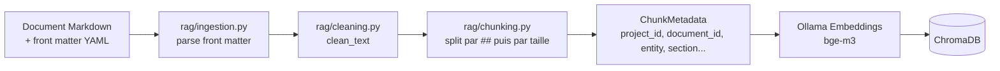
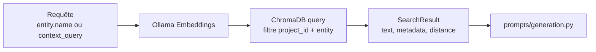
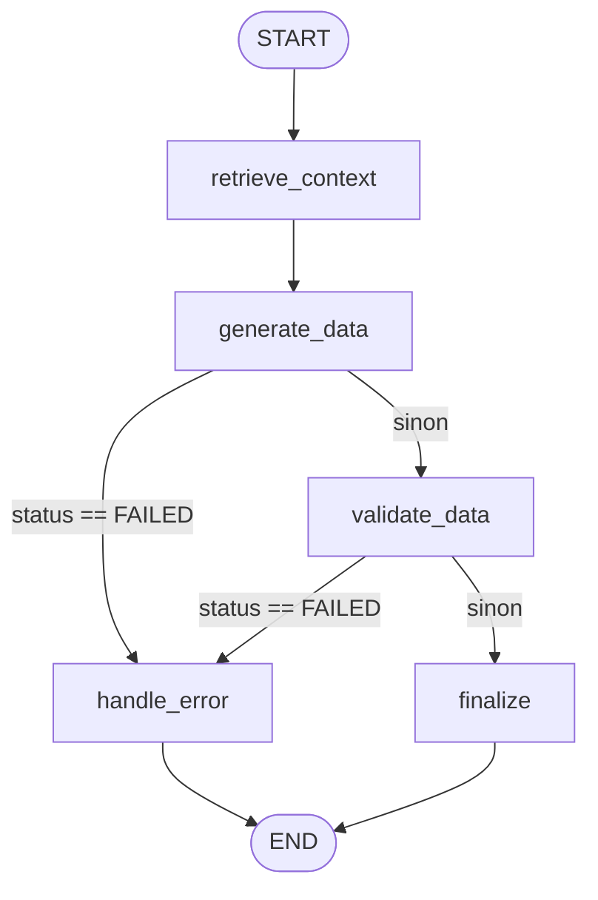
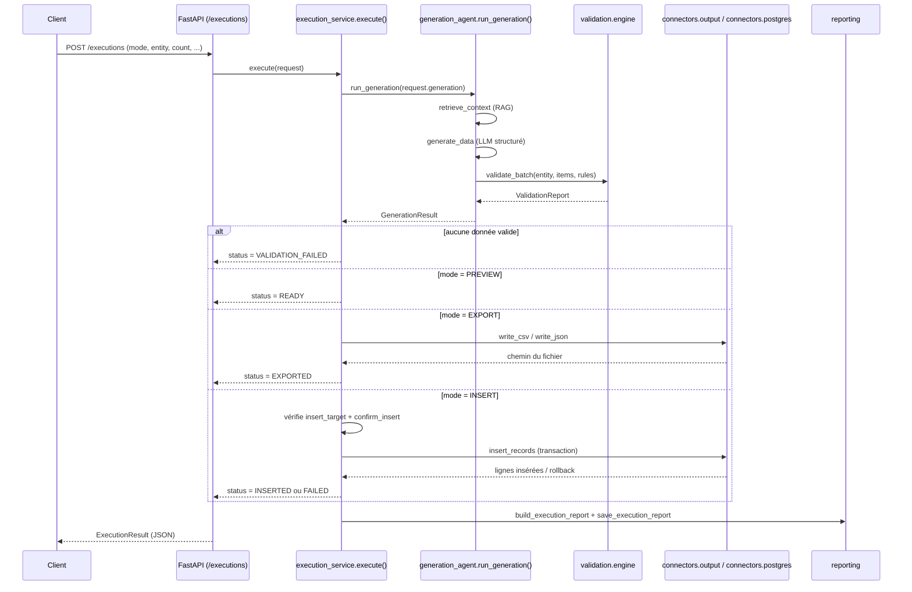
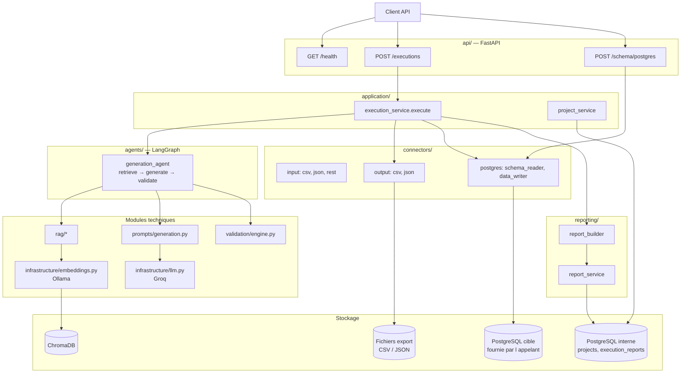

# SmartData Generator

## Architecture technique globale

**Version :** 2.0
**Statut :** Validé — reflète l'implémentation réelle
**Projet :** SmartData Generator
**Type de projet :** Proof of Concept industrialisable
**Contexte :** Certification RNCP Développeur en Intelligence Artificielle
**Dernière mise à jour :** 2026-07-29

---

## Note de révision (v2.0)

La version 1.0 de ce document a été rédigée pendant le cadrage (T1), avant l'implémentation. Elle décrivait une architecture *cible* : un orchestrateur LangGraph unique couvrant l'intégralité du workflow (chargement du projet, analyse de schéma, RAG, planification, génération, validation, Preview/Export/Insert), des services applicatifs séparés pour chaque responsabilité (Project, Document, Schema, Export, Insert), un Connector Registry avec interfaces abstraites, un Generation Planner distinct de l'exécution.

Cette version 2.0 documente **l'architecture telle qu'elle a été effectivement implémentée** à l'issue du développement. Les choix retenus en pratique sont plus simples que la cible initiale, pour des raisons données à chaque section concernée (§20). Les écarts principaux :

| Cadrage (v1.0) | Implémentation réelle (v2.0) |
|---|---|
| Un LangGraph unique orchestrant tout le cycle (schéma → RAG → plan → génération → validation → écriture) | Deux niveaux distincts : `execution_service.py` est un **dispatcher Python simple** (Preview/Export/Insert) ; LangGraph n'orchestre que le **micro-workflow de génération** (RAG → LLM → validation), dans `agents/generation_agent.py` |
| Generation Planner produisant un plan structuré séparé de l'exécution | Pas de plan intermédiaire : le prompt est construit directement à partir du schéma et du contexte RAG (`prompts/generation.py`), puis envoyé au LLM en sortie structurée |
| Project Service / Document Service / Schema Service pilotant le workflow | `application/project_service.py` gère le cycle de vie d'un projet (CRUD), mais **n'est pas encore relié** à `execution_service.py` : une exécution reçoit son entité et ses règles directement dans la requête, pas via un projet chargé automatiquement |
| Connector Registry + interfaces abstraites (`BaseConnector`, `DataWriter`, ...) | Connecteurs = modules de fonctions simples (`connectors/input/`, `connectors/output/`, `connectors/postgres/`), appelés directement par leur nom, sans registre ni classes abstraites |
| Analyse de schéma intégrée au workflow de génération | `/schema/postgres` est un endpoint autonome, non enchaîné à `/executions` : l'analyse de schéma et la génération sont deux capacités indépendantes aujourd'hui |
| Statuts `PENDING`, `RUNNING`, `WAITING_FOR_INPUT` | Non implémentés : l'exécution est synchrone (requête HTTP → réponse), il n'y a pas de step "en cours" observable ni de mécanisme de clarification interactif |

Le reste de ce document décrit l'architecture réelle en détail, section par section, avec le code source comme référence (chemins de fichiers indiqués partout). La correspondance avec les cas d'usage de [`user_cases.md`](../01_framing/user_cases.md) reste valable pour Preview/Export/Insert (§6, §7, §12) ; elle ne l'est plus pour les cas d'usage UC-04 à UC-11 (schéma, RAG, plan, génération orchestrée de bout en bout), qui décrivent la cible et non l'état actuel.

---

# 1. Introduction

SmartData Generator est un service d'intelligence artificielle indépendant conçu pour générer des données métier synthétiques, cohérentes et validées à partir :

* d'un schéma cible (fourni explicitement dans la requête, ou analysé séparément depuis PostgreSQL) ;
* de règles métier (déterministes, `BusinessRule`, ou documentaires via RAG) ;
* de documentation métier (corpus Markdown indexé dans ChromaDB) ;
* de paramètres de génération (volume, contexte).

Le cœur du service (génération, validation, connecteurs) ne contient aucune logique propre à un domaine métier particulier. Pricing Control Tower constitue un démonstrateur, pas une dépendance.

---

# 2. Objectifs de l'architecture

L'architecture doit permettre de :

* séparer clairement les responsabilités ;
* remplacer facilement un fournisseur LLM ou d'embeddings (accès toujours via `infrastructure/llm.py` et `infrastructure/embeddings.py`) ;
* ajouter de nouveaux connecteurs sans modifier le moteur ;
* produire des sorties LLM structurées et validées par Pydantic ;
* valider les données avant toute écriture ;
* garantir une confirmation explicite avant insertion ;
* tracer chaque exécution (rapport persistant, `run_id` unique) ;
* faciliter les tests (mocks via `monkeypatch`, tests d'intégration isolés par disponibilité des services externes).

---

# 3. Principes d'architecture réellement appliqués

## 3.1 Séparation en couches

Le code est organisé en modules Python à responsabilité unique (détail réel en §23) :

* `api/` — HTTP uniquement (FastAPI) ;
* `application/` — cas d'usage (`execution_service`, `project_service`) ;
* `domain/` — modèles Pydantic purs, sans dépendance technique ;
* `agents/` — le micro-workflow LangGraph de génération ;
* `rag/`, `validation/`, `connectors/`, `persistence/`, `reporting/`, `infrastructure/` — composants techniques spécialisés.

## 3.2 Domaine indépendant de l'infrastructure

`domain/*.py` ne dépend d'aucun connecteur, d'aucun client HTTP, d'aucune base de données : uniquement de Pydantic et d'autres modules `domain`. C'est ce qui permet de tester `application/execution_service.py` en substituant `run_generation`, `insert_records`, `write_csv`/`write_json` par des fonctions factices sans jamais toucher un réseau ou une base (voir `tests/test_execution_service.py`).

## 3.3 Preview par défaut, écriture jamais implicite

`ExecutionRequest.mode` vaut `"PREVIEW"` par défaut (`domain/execution.py`). Le mode Insert exige à la fois `insert_target` (destination explicite) **et** `confirm_insert=True` (confirmation explicite) — l'absence de l'un ou l'autre produit un statut `FAILED` avec un code d'erreur explicite, sans qu'aucune écriture n'ait lieu (`application/execution_service.py::_execute_insert`).

## 3.4 Validation déterministe avant toute écriture

`validation/engine.py::validate_batch` revalide chaque objet généré contre le modèle Pydantic dynamique de l'entité (`domain/schema.py::build_entity_model`), puis applique les règles métier structurées (`domain/rules.py::BusinessRule` : `range`, `allowed_values`, `unique`, `date_order`). Le LLM ne participe à aucune étape de validation : la validation est 100 % déterministe.

## 3.5 Le LLM ne déclenche jamais d'écriture

Le LLM (`infrastructure/llm.py`) n'est appelé que dans `agents/generation_agent.py::_generate_data`, pour produire les objets d'une entité en sortie structurée (`with_structured_output`). Il n'a accès à aucun connecteur, ne construit aucune requête SQL, et ne peut pas décider seul d'un Export ou d'un Insert — ces opérations sont déclenchées par l'appelant de l'API, pas par le LLM.

## 3.6 Traçabilité systématique

Chaque appel à `execute()` produit un `ExecutionReport` (`reporting/report_builder.py`), persisté en base (`reporting/report_service.py::save_execution_report`), **y compris en cas d'échec** — la persistance du rapport est elle-même protégée par un `try/except` pour ne jamais faire échouer une exécution dont le résultat métier est déjà déterminé (`execution_service.py::_record_execution_report`).

---

# 4. Vue globale de l'architecture réelle

```text
API Layer (FastAPI)
    |
    v
Application Services
    |
    +-- Project Service ------------------> Persistence Layer (PostgreSQL interne)
    |
    +-- Execution Service
            |
            +--> Generation Agent (LangGraph, 5 nœuds)
            |         |
            |         +--> RAG (ChromaDB + Ollama embeddings)
            |         +--> LLM Provider (Groq)
            |         +--> Validation Engine (déterministe)
            |
            +--> Export : connectors/output (CSV, JSON)
            |
            +--> Insert : connectors/postgres (transaction SQLAlchemy)
            |
            +--> Reporting -----------------> Persistence Layer (PostgreSQL interne)

Schema Analysis (endpoint autonome, non enchaîné à Execution Service)
    |
    v
connectors/postgres/schema_reader.py
```

Ce schéma diffère volontairement de celui du cadrage : il n'y a **pas** de couche d'orchestration unique au-dessus de tout le service. `Execution Service` (une fonction, pas un agent) appelle directement `run_generation()`, puis directement les connecteurs de sortie selon le mode. Seule la génération elle-même (RAG + LLM + validation) est un graphe LangGraph.

---

# 5. Composants réellement implémentés

## 5.1 API Layer — `api/`

Technologie : FastAPI. Point d'entrée : `api/app.py::create_app()`.

| Fichier | Rôle |
|---|---|
| `api/app.py` | Construit l'app FastAPI, enregistre les gestionnaires d'erreurs et les routeurs |
| `api/routers/health.py` | `GET /health` — statut, version (lue depuis `pyproject.toml`), environnement |
| `api/routers/executions.py` | `POST /executions` — point d'entrée unique pour Preview/Export/Insert |
| `api/routers/schema_analysis.py` | `POST /schema/postgres` — analyse d'un schéma PostgreSQL, indépendante d'une exécution |
| `api/errors.py` | Convertit `SchemaReaderError` en HTTP 502 ; toute exception non prévue devient un 500 générique sans fuite de trace interne |
| `api/schemas/` | Modèles de requête/réponse propres à l'API (`ErrorResponse`, `HealthResponse`, `PostgresSchemaRequest`) — distincts des modèles `domain/`, pour ne pas coupler le contrat HTTP au modèle métier |
| `api/dependencies.py` | Injection FastAPI de `Settings` via `Depends(get_settings)` |

Aucune route n'existe encore pour la gestion de projets (`ProjectService` n'est pas exposé en HTTP), ni pour l'upload/l'indexation de documents.

## 5.2 Execution Service — `application/execution_service.py`

Point d'entrée applicatif unique pour les trois modes. Ce n'est **pas** un agent ni un graphe : une fonction `execute(request) -> ExecutionResult` qui :

1. appelle `run_generation()` (génération + validation) ;
2. arrête immédiatement si aucune donnée valide n'a survécu (`status="VALIDATION_FAILED"`) ;
3. selon `request.mode`, retourne le résultat tel quel (`PREVIEW`), écrit un fichier (`EXPORT`, via `connectors/output`), ou insère en base (`INSERT`, via `connectors/postgres`, avec les contrôles explicites de §3.3) ;
4. construit et persiste systématiquement un `ExecutionReport`.

## 5.3 Project Service — `application/project_service.py`

CRUD complet sur `domain/project.py::Project` (créer, lire, lister, mettre à jour la configuration, activer/désactiver, supprimer), adossé à `persistence/project_repository.py`. `ProjectConfig` porte les entités, les règles métier, les paramètres de génération par défaut, et la configuration source/destination — c'est ce qui rend le service réutilisable d'un domaine à l'autre sans changer le code.

**Écart avec le cadrage :** ce service n'est pour l'instant **pas consommé** par `execution_service.py`. Une `GenerationRequest` porte son `entity` et ses `rules` directement, sans passer par `load_project_config()`. Le chaînage Project → Execution reste à faire (§21).

## 5.4 Generation Agent — `agents/generation_agent.py`

Le seul graphe LangGraph du service. État (`GenerationState`, `TypedDict`) : `run_id`, `request`, `context`, `items`, `errors`, `status`, `validation_report`.

Nœuds :

| Nœud | Rôle | Erreur associée |
|---|---|---|
| `retrieve_context` | Recherche RAG (`rag/vectorstore.py::search`) filtrée par `project_id` et `entity` | `rag_unavailable` (**non bloquant** — la génération continue sans contexte métier) |
| `generate_data` | Construit un modèle Pydantic dynamique par lot (`{Entity}Batch`), appelle le LLM en sortie structurée | `llm_generation_failed` (bloquant), `incomplete_generation` (non bloquant, si moins d'objets que demandé) |
| `validate_data` | Appelle `validation/engine.py::validate_batch` | erreurs de validation mappées en `GenerationError`, `blocking = (issue.level == ERROR)` |
| `finalize` | Nœud terminal en cas de succès | — |
| `handle_error` | Nœud terminal en cas d'échec bloquant | — |

Routage conditionnel (`_route_on_status`) : après `generate_data` et après `validate_data`, le graphe bifurque vers `handle_error` si `status == "FAILED"`, sinon continue. Le graphe est compilé une seule fois (`@lru_cache` sur `get_generation_graph()`).

## 5.5 Prompt Builder — `prompts/generation.py`

Construit le prompt envoyé au LLM (`build_generation_prompt`) : un message système fixe (rôle, interdiction d'inventer un champ, priorité des règles métier sur la connaissance générale) + un message humain assemblant le nom de l'entité, la liste des champs (nom, type, obligatoire, description), le volume demandé, et les passages RAG récupérés (ou un texte explicite si aucun résultat).

## 5.6 RAG — `rag/`

| Fichier | Rôle |
|---|---|
| `rag/schemas.py` | `DocumentCategory` (definition/rule/constraint/example/relation/convention/limit/exception), `DocumentFrontMatter`, `ChunkMetadata` |
| `rag/ingestion.py` | Lit un document Markdown, extrait son en-tête YAML (front matter obligatoire : `title`, `category`, `entity`), nettoie et découpe le corps |
| `rag/chunking.py` | Découpage en deux passes : d'abord par section `##` (`MarkdownHeaderTextSplitter`), puis par taille (`RecursiveCharacterTextSplitter`, 800 caractères, 100 de recouvrement) |
| `rag/cleaning.py` | Normalisation Unicode (NFC), fins de ligne, espaces superflus |
| `rag/vectorstore.py` | Client ChromaDB HTTP (`chromadb.HttpClient`), `upsert_chunks` (identifiants déterministes `project_id:document_id:chunk_index`, donc réindexation idempotente) et `search` (filtrée par métadonnées `project_id` + `entity`) |
| `rag/indexing.py` | `index_corpus` — ingère puis indexe tous les `.md` d'un répertoire pour un projet |

Le corpus est un ensemble de fichiers Markdown avec front matter YAML (exemple : [`rag/corpus/examples/regles_client.md`](../../rag/corpus/examples/regles_client.md)). **Aucun endpoint API n'expose l'upload ou le déclenchement d'indexation** ; ce pipeline est aujourd'hui exercé uniquement par les tests d'intégration et un corpus d'exemple.

## 5.7 Validation Engine — `validation/`

* `validation/schemas.py` : `IssueLevel` (`error`/`warning`), `ValidationIssue`, `ValidationReport` (`status` ∈ `PASSED`, `PASSED_WITH_WARNINGS`, `PARTIAL`, `FAILED`).
* `validation/engine.py::validate_batch(entity, items, rules)` :
  1. revalide chaque objet contre le modèle Pydantic de l'entité (types, champs obligatoires) → objets invalides exclus, `type_error` ;
  2. applique les `BusinessRule` fournies sur les objets restés valides : `range` (bornes inclusives/exclusives), `allowed_values`, `date_order` (comparaison de deux champs ISO 8601), `unique` (détection de doublons sur un champ) ;
  3. calcule le statut global : `FAILED` si aucun objet valide, `PARTIAL` s'il reste des erreurs mais aussi des objets valides, `PASSED_WITH_WARNINGS` s'il ne reste que des avertissements, `PASSED` sinon.

Aucun appel LLM dans ce module : entièrement déterministe.

## 5.8 Connecteurs — `connectors/`

Pas de classes abstraites ni de registre : chaque connecteur est un module de fonctions pures, importées directement par leur appelant.

**Entrée (lecture seule) — `connectors/input/`**

| Connecteur | Fonction | Particularités réelles |
|---|---|---|
| CSV | `read_csv(path, delimiter=",")` | Encodage `utf-8-sig`, ligne malformée détectée explicitement, aucune conversion de type (tout reste `str \| None`) |
| JSON | `read_json(path)` | Accepte une liste d'objets ou un objet unique ; structures profondément imbriquées non prises en charge |
| REST | `read_rest(config)` | `RestSourceConfig` explicite (URL, méthode, headers, params, timeout, `data_path` pour extraire une réponse enveloppée) ; `RestAuthConfig` supporte `none`/`bearer`/`api_key`/`basic` ; lecture uniquement, via `httpx` |

Les trois convergent vers `connectors/input/normalize.py::normalize_records` (nettoyage des clés, chaînes vides → `None`).

**Sortie (export fichier) — `connectors/output/`**

`write_csv` (en-têtes = union ordonnée des clés de tous les objets, pour ne perdre aucune colonne optionnelle) et `write_json` (tableau JSON indenté). Toute erreur d'E/S devient un `DataWriterError` avec un code stable.

**PostgreSQL (lecture + écriture) — `connectors/postgres/`**

| Fichier | Rôle |
|---|---|
| `schema.py` | Modèles Pydantic normalisés : `ColumnSchema`, `ForeignKeySchema`, `UniqueConstraintSchema`, `CheckConstraintSchema`, `TableSchema`, `DatabaseSchema` |
| `schema_reader.py` | `test_connection`, `read_schema` (introspection via `sqlalchemy.inspect`), `compute_generation_order` (tri topologique sur les clés étrangères ; auto-références ignorées ; dépendance circulaire → `SchemaReaderError(code="circular_dependency")`) |
| `data_writer.py` | `insert_records` — réflexion de la table cible (`Table(..., autoload_with=engine)`), rejet explicite des colonnes inconnues, insertion **paramétrée** (`sqlalchemy.insert`) dans une unique transaction (`engine.begin()`), `IntegrityError` → rollback automatique + `DataWriteError(code="integrity_error")` |

## 5.9 Persistence Layer — `persistence/` + `infrastructure/database.py`

SQLAlchemy **Core** (pas d'ORM) sur PostgreSQL, moteur applicatif interne (`infrastructure/database.py::get_engine`, singleton `@lru_cache`), distinct de toute base cible d'insertion.

* `persistence/tables.py` : deux tables, `projects` et `execution_reports`, chacune avec une colonne `JSONB` (`config` / `report`) portant l'objet Pydantic complet, plus quelques colonnes dupliquées pour permettre de filtrer sans parser le JSON (`project_id`, `mode`, `status`, `started_at`...). `create_all(engine)` est idempotent.
* `persistence/project_repository.py`, `persistence/report_repository.py` : fonctions CRUD directes (`select`/`insert`/`update`/`delete`), pas de couche ORM ni de mapping objet-relationnel.

## 5.10 Reporting — `reporting/`

* `reporting/report_builder.py::build_execution_report` : fonction pure assemblant un `ExecutionReport` à partir de la requête, du résultat et des horodatages (durée, volumes demandés/générés/valides/rejetés, décompte d'erreurs bloquantes vs avertissements).
* `reporting/report_service.py` : `save_execution_report` (persistance + log), `get_execution_report`, `list_project_execution_reports`.

## 5.11 Infrastructure — `infrastructure/`

| Fichier | Rôle |
|---|---|
| `config.py` | `Settings` (pydantic-settings, `.env`), `get_project_version()` (lit `pyproject.toml`) |
| `database.py` | Moteur SQLAlchemy interne, singleton |
| `llm.py` | `get_llm() -> ChatGroq` (langchain-groq), singleton |
| `embeddings.py` | `get_embeddings() -> OllamaEmbeddings` (langchain-ollama), singleton |
| `logging.py` | `logging` standard, format structuré, configuration idempotente |

`main.py` lance `uvicorn` avec les host/port de `Settings`.

---

# 6. Composants du cadrage non implémentés ou implémentés différemment

Pour la maintenabilité, il est important de savoir ce qui **n'existe pas** dans le code malgré sa présence dans le cadrage initial :

* **Generation Planner** : aucun plan structuré intermédiaire n'est produit. La génération va directement du schéma + contexte RAG à l'appel LLM.
* **Context Builder** en tant que module dédié : sa responsabilité est assurée, de façon minimale, par `prompts/generation.py`.
* **Connector Registry** et interfaces abstraites (`BaseConnector`, `DataWriter`, `TransactionalWriter`, ...) : les connecteurs sont des fonctions, sélectionnées par l'appelant (le routeur ou le service) au lieu d'être résolues dynamiquement.
* **Document Service** et endpoints d'upload/indexation : le pipeline RAG (§5.6) existe et est testé, mais n'est relié à aucune route HTTP.
* **Schema Service** : `/schema/postgres` (§5.1) n'écrit rien en base et n'est appelé par aucun autre composant ; il n'y a pas de rapprochement automatique entre un schéma analysé et une `GenerationRequest`.
* **Chaînage Project → Execution** : `ProjectConfig.entities`/`rules` ne sont pas encore lus par `execution_service.py`.
* **Clarification interactive** (`WAITING_FOR_INPUT`) : n'existe pas — une information manquante ne suspend pas l'exécution, elle produit au mieux un `GenerationError` non bloquant (RAG vide) ou fait échouer la génération (LLM).
* **Statuts `PENDING` / `RUNNING`** : sans intérêt dans un modèle synchrone requête/réponse ; seuls `READY`, `VALIDATION_FAILED`, `EXPORTED`, `INSERTED`, `FAILED` sont atteignables (`domain/execution.py::ExecutionStatus`).

---

# 7. Architecture RAG réelle

## 7.1 Workflow d'indexation



`index_corpus(corpus_dir, project_id)` ingère tous les `*.md` d'un répertoire et retourne le nombre de chunks indexés. Les identifiants de chunk (`project_id:document_id:chunk_index`) sont déterministes : réindexer un corpus inchangé écrase les mêmes entrées au lieu de les dupliquer.

## 7.2 Workflow de recherche



`search(query, project_id, k=5, entity=None)` filtre systématiquement par `project_id` (isolation stricte entre projets) et, si fourni, par `entity`. Retourne une liste vide (jamais une exception propagée) si ChromaDB ou Ollama est indisponible — l'appelant (`_retrieve_context`) transforme cette situation en `GenerationError(code="rag_unavailable", blocking=False)`.

## 7.3 Règle fondamentale

Le RAG fournit du texte métier brut au prompt ; il ne produit ni schéma ni règle exécutable. Une règle réellement critique doit être exprimée comme `BusinessRule` (déterministe, §5.7), pas seulement comme passage documentaire.

---

# 8. Intégration du LLM

* **Fournisseur** : Groq (`langchain-groq`), modèle `llama-3.3-70b-versatile` par défaut (configurable via `LLM_MODEL`).
* **Accès** : exclusivement via `infrastructure/llm.py::get_llm()`, un singleton `ChatGroq`. Aucun autre module n'importe `langchain_groq` directement.
* **Sortie structurée** : `get_llm().with_structured_output(batch_model)`, où `batch_model` est un modèle Pydantic généré dynamiquement (`{Entity}Batch`, contenant `items: list[{Entity}]`) à partir du schéma fourni dans la requête. C'est le mécanisme qui garantit que la sortie du LLM respecte le schéma cible sans post-traitement fragile.
* **Erreurs** : toute exception levée par le fournisseur est interceptée (`except Exception` explicitement commenté comme frontière fournisseur) et convertie en `GenerationError(code="llm_generation_failed", blocking=True)` — jamais propagée telle quelle jusqu'à l'API.
* **Remplacement de fournisseur** : changer de fournisseur LLM revient à ne modifier que `infrastructure/llm.py` (et la configuration) ; aucun autre module ne connaît Groq.

---

# 9. Le graphe LangGraph de génération (réel)



Ce graphe (`agents/generation_agent.py::get_generation_graph`) est **le seul** LangGraph du service. Il ne couvre ni l'analyse de schéma, ni l'Export, ni l'Insert : ces étapes sont des appels de fonction directs dans `execution_service.py`, en dehors de tout graphe. La compilation du graphe est mise en cache (`@lru_cache`) — un seul objet compilé est réutilisé pour toutes les exécutions du processus.

---

# 10. Architecture des connecteurs

## 10.1 Matrice des capacités (réelle)

| Connecteur | Analyse de schéma | Lecture | Écriture | Export | Transaction |
| ---------- | -----------------: | ------: | -------: | -----: | -----------: |
| CSV        | Non (types non déduits) | Oui | Non | Oui | Non |
| JSON       | Non (types non déduits) | Oui | Non | Oui | Non |
| REST       | Non | Oui (GET/POST configurés) | Non | Non | Non |
| PostgreSQL | Oui (introspection complète) | Non implémenté* | Oui | Non | Oui |

\* La lecture de données existantes en PostgreSQL (pour éviter des conflits d'unicité, cf. `user_cases.md` PREVIEW-04) n'est pas implémentée ; seules l'introspection de schéma (`read_schema`) et l'insertion (`insert_records`) le sont.

## 10.2 Indépendance des connecteurs

Vérifié dans le code : aucun module de `connectors/` n'importe `agents/`, `rag/`, ni `infrastructure/llm.py`. Les connecteurs ne connaissent que leurs propres modèles de configuration (Pydantic) et des types `dict`/`list[dict]` génériques en entrée/sortie.

---

# 11. Mécanismes de validation (réels)

## 11.1 Validation des requêtes API

FastAPI + Pydantic v2 valident automatiquement `ExecutionRequest`, `GenerationRequest`, `PostgresSchemaRequest` (types, champs obligatoires, `Literal` pour les modes/formats). Une requête invalide reçoit un `422` avant même d'atteindre `application/`.

## 11.2 Validation du schéma cible

`domain/schema.py::build_entity_model` construit un modèle Pydantic dynamique à partir d'`EntitySpec` : c'est ce modèle qui sert à la fois de contrat de sortie pour le LLM et de première passe de validation dans `validate_batch`.

## 11.3 Validation des sorties LLM

Garantie structurellement par `with_structured_output(batch_model)` (§8) : LangChain rejette/retente une sortie qui ne respecte pas le schéma Pydantic attendu avant de la retourner à l'appelant.

## 11.4 Validation des données générées

`validate_batch` (§5.7) : types → règles métier déterministes → agrégation en `ValidationReport`.

## 11.5 Validation avant Export

`execution_service.py::_dispatch` vérifie `_blocked_by_validation` (statut `FAILED` ou aucun item) **avant** d'atteindre `_execute_export`/`_execute_insert`. Si tout est bloqué, le mode retourne `VALIDATION_FAILED` sans qu'aucun fichier ne soit écrit ni qu'aucune connexion ne soit ouverte.

## 11.6 Validation avant Insert

En plus du contrôle précédent : présence de `insert_target` (`insert_target_missing`), présence de `confirm_insert=True` (`insert_not_confirmed`) — voir §3.3.

## 11.7 Validation transactionnelle

`connectors/postgres/data_writer.py::insert_records` : une seule transaction SQLAlchemy (`engine.begin()`) couvre l'insertion de tous les objets ; toute `IntegrityError` provoque un rollback automatique (comportement natif de `engine.begin()` en cas d'exception) et aucune ligne partielle n'est conservée.

---

# 12. Flux de données réels

## 12.1 Flux Preview / Export / Insert



## 12.2 Flux d'analyse de schéma (indépendant)

```text
Client → POST /schema/postgres → connectors.postgres.schema_reader.read_schema()
       → sqlalchemy.inspect() → DatabaseSchema (tables, colonnes, FK, ordre de génération)
       → réponse HTTP directe (rien n'est persisté)
```

---

# 13. Diagramme d'architecture globale (réel)



---

# 14. Diagramme du graphe de génération

Voir §9 (le graphe est déjà présenté en détail).

---

# 15. Sécurité

Principes appliqués dans le code actuel :

* aucun secret dans le dépôt : `.env` est ignoré par git (`.gitignore`), lu via `pydantic-settings` ;
* requêtes paramétrées uniquement (`sqlalchemy.insert`, jamais de SQL assemblé par concaténation) ;
* interdiction structurelle du SQL généré par le LLM : le LLM ne produit que des objets Pydantic (`with_structured_output`), jamais de texte SQL, et n'a accès à aucun connecteur ;
* confirmation explicite avant toute insertion (§3.3) ;
* messages d'erreur internes non exposés au client : le handler générique (`api/errors.py::_unexpected_error_handler`) retourne toujours `{"code": "internal_error", "message": "Une erreur interne est survenue."}` sur 500, la trace complète restant uniquement dans les logs serveur (`logger.exception`).

Écarts connus par rapport au cadrage (à traiter avant une mise en production) :

* aucun chiffrement ni masquage des mots de passe de connexion (`database_url` circule et est loggé tel quel dans certains messages d'erreur, ex. `data_writer.py` via le message d'exception SQLAlchemy) ;
* pas de limitation de taille de requête HTTP, pas de limitation de taille de document RAG ;
* pas de gestion de secrets externalisée (Vault, AWS Secrets Manager, ...) — un seul `.env` local.

---

# 16. Gestion des erreurs (catalogue réel)

Chaque connecteur définit sa propre exception avec un `code` stable et un `message` :

| Exception | Codes observés dans le code |
|---|---|
| `DataReaderError` (`connectors/input/errors.py`) | `file_not_found`, `not_a_file`, `empty_file`, `encoding_error`, `csv_parse_error`, `malformed_row`, `json_parse_error`, `invalid_json_structure`, `invalid_auth_config`, `data_path_not_found`, `timeout`, `http_error`, `connection_error`, `invalid_json_response` |
| `DataWriterError` (`connectors/output/errors.py`) | `no_data`, `write_error` |
| `SchemaReaderError` (`connectors/postgres/errors.py`) | `connection_error`, `empty_schema`, `introspection_error`, `circular_dependency` |
| `DataWriteError` (`connectors/postgres/errors.py`) | `connection_error`, `table_not_found`, `unknown_column`, `integrity_error`, `insert_error`, `no_data` |
| `GenerationError` (`domain/generation.py`, `code`/`stage`/`blocking`) | `rag_unavailable` (non bloquant), `llm_generation_failed` (bloquant), `incomplete_generation` (non bloquant), `insert_target_missing` (bloquant), `insert_not_confirmed` (bloquant), + tout code de `ValidationIssue` reporté comme erreur de validation |

`api/errors.py` ne mappe explicitement en HTTP que `SchemaReaderError` (→ 502) ; `DataWriteError`/`DataWriterError` ne sont aujourd'hui interceptées qu'à l'intérieur d'`execution_service.py` et transformées en `GenerationError` dans la réponse `200` (§ jamais d'erreur HTTP pour un échec métier d'Export/Insert — voir la description de la route dans `api/routers/executions.py`).

---

# 17. Observabilité (état réel)

* Logs structurés via le module `logging` standard (`infrastructure/logging.py`), format `%(asctime)s level=%(levelname)s logger=%(name)s %(message)s`.
* Chaque exécution est identifiée par un `run_id` (`uuid4().hex`) préfixant systématiquement les lignes de log de `execution_service.py` et `generation_agent.py` (`[%s] ...`).
* Le rapport d'exécution (`ExecutionReport`) contient durée, volumes, décompte d'erreurs bloquantes/non bloquantes — interrogeable via `reporting/report_service.py`.

Non implémenté : métriques (Prometheus ou équivalent), traçage distribué, tableau de bord. Le seul "monitoring" possible aujourd'hui est la lecture des logs et des rapports en base.

---

# 18. Testabilité (réelle)

* **Tests unitaires** (`tests/*.py`, hors `tests/integration/`) : substituent les frontières externes par `monkeypatch` (ex. `run_generation`, `save_execution_report`, `insert_records`) — aucun réseau, aucune base réelle. 111 tests à ce jour.
* **Tests d'intégration** (`tests/integration/*.py`) : s'exécutent contre de vrais services (PostgreSQL, ChromaDB, Ollama, Groq), sautés automatiquement (`pytest.mark.skipif`) via `tests/integration/_reachability.py::is_reachable` si le service n'est pas joignable — pas de conteneurs de test éphémères, les services doivent être démarrés au préalable (`docker compose -f docker/docker-compose.yml up -d`).
* **CI** (`.github/workflows/ci.yml`) : `ruff check` + `pytest` sur chaque push/PR vers `main`, suivi d'une release sémantique automatique (`python-semantic-release`) basée sur les messages de commit conventionnels.

---

# 19. Organisation réelle du code

```text
.
├── agents/                  # Le seul graphe LangGraph (génération)
├── api/
│   ├── routers/              # health, executions, schema_analysis
│   └── schemas/               # Contrats HTTP (distincts de domain/)
├── application/              # execution_service, project_service
├── connectors/
│   ├── input/                 # csv, json, rest (lecture seule)
│   ├── output/                 # csv, json (export)
│   └── postgres/                # schema_reader (lecture) + data_writer (écriture)
├── domain/                   # Modèles Pydantic purs
├── infrastructure/           # config, database, llm, embeddings, logging
├── persistence/              # SQLAlchemy Core : projects, execution_reports
├── prompts/                  # Construction des prompts LLM
├── rag/                      # ingestion, chunking, cleaning, vectorstore, indexing
├── reporting/                # report_builder, report_service
├── validation/               # engine (règles déterministes), schemas
├── docker/                   # docker-compose (PostgreSQL applicatif + ChromaDB)
├── docs/                     # 01_framing, 02_architecture, 03_validation
├── tests/                    # unitaires
│   └── integration/            # contre services réels, skip si indisponibles
└── main.py                   # point d'entrée uvicorn
```

Cette organisation correspond à ce qui existe réellement dans le dépôt (vérifié par `find . -name "*.py"`), pas à la structure indicative `app/...` envisagée au cadrage.

---

# 20. Choix techniques justifiés

## 20.1 FastAPI + Pydantic v2 pour l'API et tous les contrats de données

**Choix.** FastAPI comme framework HTTP, Pydantic v2 comme unique mécanisme de validation de données dans tout le projet (requêtes API, `domain/`, sorties LLM structurées, configuration).
**Justification.** Un seul mécanisme de validation, du contrat HTTP jusqu'à la sortie du LLM, évite la duplication de règles de validation entre couches. `with_structured_output` (LangChain) s'appuie nativement sur des modèles Pydantic, ce qui permet de réutiliser le même `EntitySpec → build_entity_model()` à la fois pour valider l'entrée API et pour contraindre la sortie du LLM — sans cela, il aurait fallu maintenir deux schémas en parallèle.

## 20.2 SQLAlchemy Core (pas d'ORM) pour tout accès PostgreSQL

**Choix.** `sqlalchemy` est utilisé en mode Core (`Table`, `select`, `insert`, `update`) partout — stockage interne (`persistence/`) comme insertion dans une base cible (`connectors/postgres/data_writer.py`) — jamais l'ORM déclaratif (`declarative_base`, sessions).
**Justification.** L'insertion cible (`data_writer.py`) doit fonctionner sur un schéma **inconnu à l'avance** (fourni par l'appelant à l'exécution) : `Table(table, MetaData(), autoload_with=engine)` reflète la table au moment de l'appel, ce qu'un mapping ORM statique ne permet pas nativement. Utiliser Core partout (plutôt que Core pour la cible et ORM pour l'interne) évite de maintenir deux façons différentes d'écrire des requêtes SQL dans le même projet.

## 20.3 psycopg (v3) comme driver PostgreSQL

**Choix.** `postgresql+psycopg://` (psycopg 3, pas `psycopg2`).
**Justification.** Support natif de Python 3.12+ et de l'API asynchrone (non utilisée aujourd'hui mais laissant la porte ouverte), maintenance active, recommandé par SQLAlchemy 2.x pour les nouveaux projets.

## 20.4 LangGraph limité au micro-workflow de génération, pas à l'orchestration globale

**Choix.** Un seul graphe LangGraph (§9), circonscrit à RAG → génération LLM → validation. Le dispatch Preview/Export/Insert (`execution_service.py`) reste du Python simple, pas un graphe.
**Justification.** LangGraph apporte de la valeur là où il y a un vrai enchaînement conditionnel avec état partagé et retries potentiels (récupération de contexte, génération, validation — trois étapes qui peuvent échouer indépendamment et doivent router différemment selon le résultat). Le dispatch Preview/Export/Insert, lui, est un simple `if/elif` sur un champ `mode` connu à l'avance : le formaliser en graphe n'aurait ajouté que de la complexité (état à sérialiser, nœuds à tester séparément) sans bénéfice, pour un besoin qui reste un dispatcher classique.

## 20.5 Groq comme fournisseur LLM

**Choix.** `langchain-groq` / `ChatGroq`, modèle `llama-3.3-70b-versatile`.
**Justification.** Latence d'inférence très basse (LPU Groq), gratuit en usage POC dans les limites du tier utilisé, et `with_structured_output` fonctionne de façon fiable avec ce modèle. L'abstraction (`infrastructure/llm.py`) limite le coût d'un changement de fournisseur à un seul fichier.

## 20.6 Ollama (local) + ChromaDB pour le RAG

**Choix.** Embeddings via `langchain-ollama` (modèle `bge-m3`, exécuté localement), stockage vectoriel via `chromadb.HttpClient`.
**Justification.** Ollama local évite d'envoyer la documentation métier (potentiellement sensible) à un service tiers pour le seul calcul d'embeddings, et élimine un coût par appel. ChromaDB est simple à opérer en local (`docker-compose`), suffisant pour le volume documentaire d'un POC, et son API Python est directe (pas de couche d'abstraction supplémentaire nécessaire pour ce périmètre).
**Limite assumée** : le modèle d'embeddings doit être pré-téléchargé sur l'instance Ollama (`ollama pull bge-m3`) — une dépendance d'environnement documentée dans [`docs/03_validation/service_validation_report.md`](../03_validation/service_validation_report.md) §2.1.

## 20.7 Connecteurs = fonctions, pas de Connector Registry ni d'interfaces abstraites

**Choix.** Chaque connecteur expose des fonctions simples (`read_csv`, `write_json`, `insert_records`, ...), sélectionnées par import direct plutôt que via un registre dynamique.
**Justification.** Avec quatre connecteurs fixes et un nombre de capacités limité (§10.1), un registre + des interfaces abstraites (`BaseConnector`, `DataWriter`, ...) auraient ajouté une indirection sans bénéfice mesurable pour ce périmètre : personne n'instancie de connecteur dynamiquement au runtime aujourd'hui. Ce choix est documenté comme dette délibérée (§21) : le jour où un connecteur devient sélectionnable dynamiquement depuis la configuration d'un projet, un registre redevient justifié.

## 20.8 Exécution synchrone (pas de file d'attente / worker asynchrone)

**Choix.** `POST /executions` exécute génération + validation + écriture de façon synchrone dans la requête HTTP, sans file de messages ni worker en arrière-plan.
**Justification.** Les volumes visés par le POC (`GenerationRequest.count` plafonné à 50, `domain/generation.py::_MAX_COUNT`) et la latence Groq restent compatibles avec un aller-retour HTTP classique. Une file asynchrone (Celery, RQ, ARQ...) aurait ajouté un composant d'infrastructure supplémentaire à opérer et tester, pour un gain non nécessaire à ce stade (voir §21 pour la trajectoire si les volumes augmentent).

## 20.9 uv comme gestionnaire de dépendances, ruff comme linter, semantic-release pour le versioning

**Choix.** `pyproject.toml` + `uv` (résolution et environnement), `ruff` (lint, exécuté en CI), `python-semantic-release` (versioning automatique à partir des messages de commit conventionnels, déclenché sur push vers `main`).
**Justification.** Chaîne d'outils cohérente et rapide (uv), qui élimine la dérive entre environnement local et CI (`uv sync` exact sur les deux) — c'est d'ailleurs l'absence de cette synchronisation qui a été identifiée comme cause de l'échec initial de la suite de tests (cf. [`docs/03_validation/service_validation_report.md`](../03_validation/service_validation_report.md) §2). Le versioning automatique évite les oublis de bump de version manuels sur un projet à cadence de commits élevée.

## 20.10 Séparation stricte entre base interne et base cible

**Choix.** `infrastructure/database.py::get_engine()` (base interne, `DATABASE_URL`) et `insert_records(database_url=...)` (base cible, fournie dans la requête `ExecutionRequest.insert_target`) n'ont aucun code ni configuration en commun.
**Justification.** Empêche structurellement qu'une opération applicative interne (sauvegarde d'un projet, d'un rapport) puisse accidentellement écrire dans la base d'un client, et inversement qu'une insertion cible ne puisse jamais toucher aux tables internes du service — la fonction `insert_records` ne connaît même pas l'existence des tables `projects`/`execution_reports`.

---

# 21. Évolutivité — ce qu'il reste à faire pour rejoindre la cible du cadrage

Pour repartir de l'implémentation actuelle vers la cible complète décrite en cadrage, dans l'ordre de valeur/complexité :

1. **Chaîner Project Service → Execution Service** : charger `ProjectConfig.entities`/`rules` automatiquement depuis un `project_id` plutôt que de les répéter dans chaque `GenerationRequest`.
2. **Exposer le pipeline RAG en API** : routes d'upload de document et de déclenchement d'indexation (`rag/indexing.py` existe déjà, il manque la façade HTTP).
3. **Relier l'analyse de schéma à la génération** : utiliser `DatabaseSchema` (issu de `/schema/postgres`) pour construire automatiquement des `EntitySpec`, dans l'ordre donné par `generation_order`.
4. **Introduire un Connector Registry** si/quand le choix du connecteur doit devenir dynamique (piloté par `ProjectConfig.source.type` au lieu d'un import direct).
5. **Ajouter la lecture de données existantes** côté PostgreSQL (pour PREVIEW-04 : éviter les conflits d'unicité avec des données déjà présentes).
6. **Passer à un modèle asynchrone** si les volumes ou le nombre d'exécutions concurrentes dépassent ce que le mode synchrone actuel absorbe confortablement.

---

# 22. Limites de l'implémentation actuelle

En plus des limites de périmètre déjà actées au cadrage (pas de NoSQL, pas de Big Data, pas de streaming, écriture REST hors périmètre, etc. — inchangées), les limites suivantes sont spécifiques à l'état actuel du code :

* pas de gestion d'utilisateurs ni d'authentification sur l'API (`api/app.py` n'a aucun middleware d'auth) ;
* pas de pagination sur `list_all_projects` / `list_execution_reports` ;
* le volume de génération est plafonné à 50 objets par requête (`domain/generation.py::_MAX_COUNT`) ;
* aucune reprise après échec partiel autre que le rollback transactionnel PostgreSQL (pas de file de retry) ;
* le modèle d'embeddings RAG doit être provisionné manuellement sur l'instance Ollama utilisée (aucune vérification automatique au démarrage).

---

# 23. Décisions d'architecture retenues (mises à jour)

* SmartData Generator reste un projet indépendant, sans logique Pricing Control Tower dans le cœur ;
* FastAPI pour l'API, Pydantic v2 pour tous les contrats de données ;
* SQLAlchemy Core (pas d'ORM) + psycopg3 pour tout accès PostgreSQL, interne comme cible ;
* LangGraph limité au micro-workflow de génération (RAG → LLM → validation), pas à l'orchestration globale du service ;
* Groq pour le LLM, Ollama + ChromaDB pour le RAG, chacun encapsulé derrière une interface d'un seul fichier (`infrastructure/llm.py`, `infrastructure/embeddings.py`) ;
* connecteurs sous forme de fonctions simples, sans registre ni interfaces abstraites, choix documenté comme dette délibérée ;
* le Validation Engine est 100 % déterministe, le LLM n'y participe jamais ;
* Preview reste le mode par défaut ; Export et Insert exigent la même génération validée en amont ; Insert exige en plus une cible explicite et une confirmation explicite ;
* toute exécution (succès ou échec) produit un rapport persistant, y compris quand la persistance elle-même échoue (le résultat métier n'est jamais perdu pour autant) ;
* exécution synchrone, sans file de messages ni worker asynchrone, adaptée au volume actuel du POC ;
* uv + ruff + semantic-release pour la chaîne d'outillage et le versioning.

---

# 24. Critères de validation de ce document

Ce document est considéré comme à jour lorsque :

* chaque composant décrit correspond à un fichier réellement présent dans le dépôt (vérifié section par section) ;
* les écarts avec le cadrage initial sont explicitement listés, pas seulement omis (§0, §6) ;
* au moins un diagramme illustre l'architecture globale, le graphe de génération, et le flux Preview/Export/Insert (§7, §9, §12, §13) ;
* chaque choix technique significatif (§20) est justifié par une raison concrète, pas seulement énoncé ;
* les limites et la trajectoire d'évolution sont explicites plutôt qu'implicites (§21, §22).

---

# 25. Conclusion

L'architecture réellement construite est plus simple que celle envisagée au cadrage, par choix assumé plutôt que par raccourci non documenté : un dispatcher applicatif direct pour Preview/Export/Insert, un unique graphe LangGraph circonscrit à la génération, des connecteurs sous forme de fonctions plutôt que d'interfaces abstraites, une exécution synchrone plutôt qu'asynchrone.

Les invariants de sécurité et de fiabilité du cadrage sont, eux, intégralement respectés dans le code : Preview par défaut, aucune écriture implicite, confirmation explicite avant Insert, validation déterministe avant toute écriture, transactions PostgreSQL avec rollback automatique, traçabilité systématique par rapport d'exécution.

Ce document (§21) trace explicitement le chemin restant pour rejoindre la cible complète du cadrage — chaînage Project → Execution, exposition du RAG en API, rapprochement schéma ↔ génération — sans que cela remette en cause la structure actuelle, conçue pour absorber ces évolutions de façon additive.
